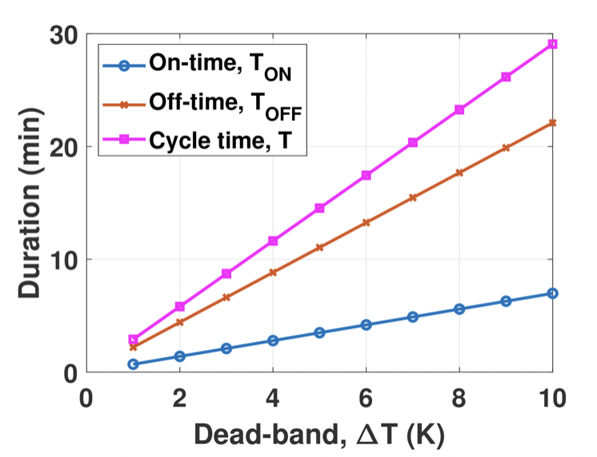

# Electrical Power Consumption Profile Modelling of Air Conditioner for Smart Grid Load Management
Official repository for AC Power Consumption Profile Modelling, ICECE 2020

## [Paper][paper] || [Video][video]

[paper]: http://naimulhassan.github.io/content/papers/profile-modelling-sg.pdf
[video]: https://youtu.be/cCWsRMCYUFg

          
          
</td>

Abstract: <i>Air conditioning (AC) system will be an inherent part of smart grid (SG) demand response as it is responsible for a substantial amount of power consumption in total infrastructure. It is invaluable to estimate the nature of operational characteristics of AC compressors in order to implement associated optimization strategy for energy preservation in residential premises. In this paper, the electrical power consumption profile, i.e., On-time and Off-time durations and power consumptions during these time durations is modelled for a split type AC compressor in terms of co-efficient of performance, AC capacity and environment condition. Dead-band temperature and room dimensions are considered as environment condition and the effect of various parameters on On-time and Off-time durations and energy consumption is studied. The factors that can be optimized to reduce the energy consumption are also analyzed.</i>

## Usage
<ul>
     <li>Hubert_Model.m--- One parameter profile modelling following <a href="https://ieeexplore.ieee.org/document/6377250)%5C">Hubert's paper</a></li>
     <li>Wang_Model.m--- Two parameter profile modelling following <a href="https://ieeexplore.ieee.org/abstract/document/8944241)%5C">Wang's paper</a></li>
     <li>CycleTimeAndPowerConsumption.m--- Final model for cycle time and power consumption</li>
     <li>Energy_Consumption.m--- Final model for energy consumption</li>
     <li>SaveintoTiff.m--- Save figures into tiff</li>
</ul>
 

## Citation
@INPROCEEDINGS{9393101,  
author={Hassan, K M Naimul and Biswas, Soumav and Uddin, Md. Forkan},  booktitle={2020 11th International Conference on Electrical and Computer Engineering (ICECE)},   
title={Electrical Power Consumption Profile Modelling of Air Conditioner for Smart Grid Load Management},   
year={2020},  
volume={},  
number={},  
pages={178-181},  
doi={10.1109/ICECE51571.2020.9393101}}
